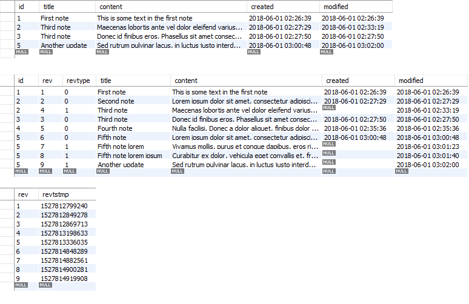

# Backend Developer Assignment

The goal of this assignment is to implement RESTful API webservice that will be responsible for
managing and storing in database simple notes (without the UI part).

### What is required for running the project

Database Management System: MySQL 8.0.11

IDE: IntelliJ IDEA with Maven

Server: Tomcat server 9.0.6

API development environment: Postman

### Steps how to run scripts that will setup database for the project

/* Open MySQL Workbench On and create user on your Local instance MySQL Router */

/* Create user */

CREATE USER 'backendNotesUser'@'localhost' IDENTIFIED BY 'backendNotesPassword';

GRANT ALL PRIVILEGES ON * . * TO 'backendNotesUser'@'localhost';

/* Alter user */

ALTER USER 'backendNotesUser'@'localhost' IDENTIFIED WITH mysql_native_password By 'backendNotesPassword';

/* Set up new connection, use 127.0.0.1 for Hostname, backendNotesUser for Username */

/* Connect using backendNotesPassword as password */

/* Create database */

CREATE DATABASE  IF NOT EXISTS `backend_notes` /*!40100 DEFAULT CHARACTER SET latin1 */;
USE `backend_notes`;

DROP TABLE IF EXISTS `notes`;

CREATE TABLE `notes` (
  `id` int(11) NOT NULL AUTO_INCREMENT,
  `title` varchar(45) DEFAULT NULL,
  `content` text DEFAULT NULL,
  `created` datetime DEFAULT NULL,
  `modified` datetime DEFAULT NULL,
  PRIMARY KEY (`id`)
) ENGINE=InnoDB AUTO_INCREMENT=1 DEFAULT CHARSET=latin1;

/* Create table revinfo for auditing */

CREATE TABLE revinfo
(
rev integer NOT NULL AUTO_INCREMENT,
revtstmp bigint,
CONSTRAINT revinfo_pkey PRIMARY KEY (rev)
);

/* Create table notes_aud where every version of a note is stored */

CREATE TABLE notes_aud
(
id int NOT NULL,
rev integer NOT NULL,
revtype smallint,
title varchar(45) DEFAULT NULL,
content text DEFAULT NULL,
created datetime DEFAULT NULL,
modified datetime DEFAULT NULL,
CONSTRAINT notes_aud_pkey PRIMARY KEY (id, rev),
CONSTRAINT notes_aud_revinfo FOREIGN KEY (rev)
REFERENCES revinfo (rev) MATCH SIMPLE
ON UPDATE NO ACTION ON DELETE NO ACTION
)

### Steps how to build and run the project

1. git clone https://github.com/Rafsters/BackendAssignment

2. Set up database in MySQL Workbench with scripts mentioned above

3. Open project with IDE and run it on server.

### Example usages (Use API development environment: Postman)

1. Get a list of notes

	GET http://localhost:8080/api/notes

2. Get a single note (for id=2)

	GET http://localhost:8080/api/notes/2

3. Add a new note 

	POST http://localhost:8080/api/notes 

	In Postman, be sure to select options: Body > raw > JSON (application/json)

	Put the following JSON in request message body.

	{
		"title": "Title of the note",
		"content": "This is some text in the note"
	}

4. Update an existing note (for id=2)

	PUT http://localhost:8080/api/notes/2

	In Postman, be sure to select options: Body > raw > JSON (application/json)

	Put the following JSON in request message body.

	{
		"title": "Updated title",
		"content": "This is some updated content of the note"
	}

5. Delete a note (for id=4)

	DELETE http://localhost:8080/api/notes/4

6. Get history of changes for particular note (for id=2)

	GET http://localhost:8080/api/notes/history/2

	
### Example data 

